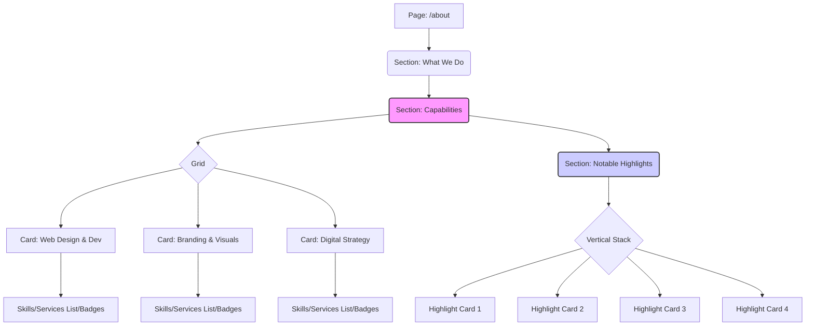

# About Page Structure Proposal (Redesign)

**Version:** 1.0
**Date:** 2025-04-13

This document outlines the proposed component structure for the redesigned About page (`src/app/about/page.tsx`), aiming for a more premium, cohesive, and engaging presentation.

## 1. Overall Layout

The page will retain a vertical flow but with enhanced visual structure and component usage. Consistent padding and spacing will be applied.

```
Root Div (max-w-screen-2xl, mx-auto, py-*, px-*)
│
├── Section: "What We Do"
│   ├── h1: Main Heading
│   └── p: Introductory Paragraph (max-w-3xl, mx-auto, text-center)
│
├── Section: "Capabilities" / "Expertise" (mt-*, max-w-4xl, mx-auto)
│   ├── h2: Section Heading (text-center)
│   └── div: Responsive Grid (e.g., grid-cols-1 md:grid-cols-2 lg:grid-cols-3 gap-*)
│       ├── Card Component 1 (Capability: e.g., Web Design & Dev)
│       │   ├── CardHeader: Title + Optional Icon
│       │   └── CardContent: List/Badges of specific skills/services
│       ├── Card Component 2 (Capability: e.g., Branding & Visuals)
│       │   ├── CardHeader: Title + Optional Icon
│       │   └── CardContent: List/Badges of specific skills/services
│       └── Card Component 3 (Capability: e.g., Digital Strategy)
│           ├── CardHeader: Title + Optional Icon
│           └── CardContent: List/Badges of specific skills/services
│
└── Section: "Notable Highlights" (mt-*, max-w-3xl, mx-auto)
    ├── h2: Section Heading (text-center)
    └── div: Vertical Stack (space-y-*)
        ├── Highlight Item 1 (Styled Container: e.g., div/Card with border, bg, padding)
        │   ├── Icon (e.g., Emoji or Lucide Icon)
        │   └── p: Highlight Text (with `<strong>` tags)
        ├── Highlight Item 2 (Styled Container)
        │   ├── Icon
        │   └── p: Highlight Text
        ├── Highlight Item 3 (Styled Container)
        │   ├── Icon
        │   └── p: Highlight Text
        └── Highlight Item 4 (Styled Container)
            ├── Icon
            └── p: Highlight Text
```

## 2. Visual Representation (Mermaid)



## 3. Key Components to Use

*   `@/components/ui/card`: For structuring "Capabilities" and potentially "Notable Highlights".
*   `@/components/ui/badge`: For listing specific skills/services within Capability cards (use `variant="secondary"` or `variant="outline"` consistently).
*   `lucide-react` icons: Optionally for Capability card headers and Notable Highlight items.

This structure aims to group related information logically (Services + Skills -> Capabilities) and present key achievements (Highlights) with greater visual prominence.
